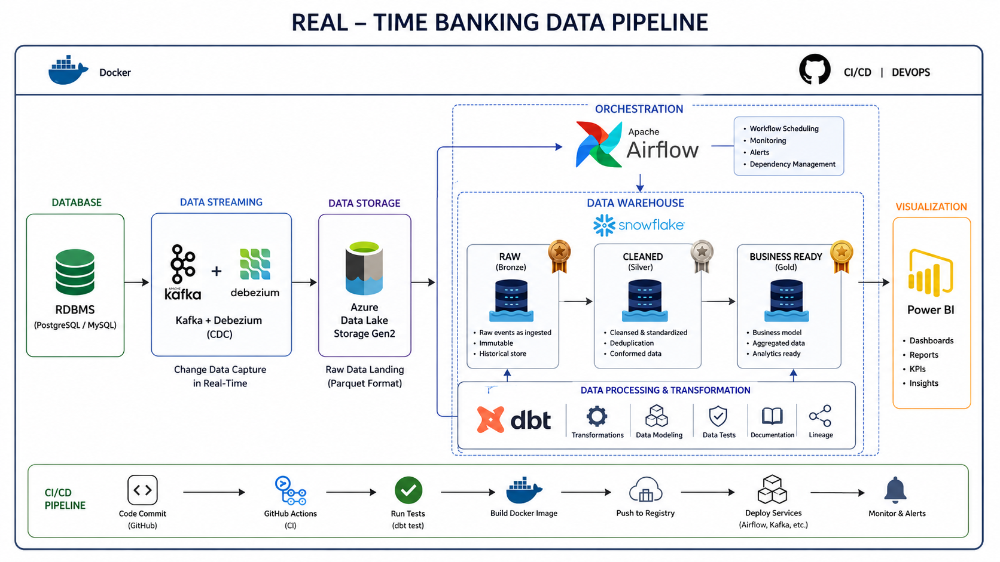
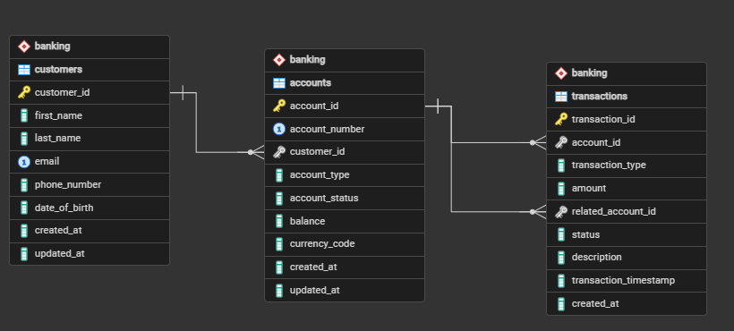

# End-to-End Banking Data Engineering Pipeline

## Project Overview

This project demonstrates an end-to-end modern data engineering pipeline for a banking domain.

The system simulates a real-world banking environment by generating customer, account, and transaction data, capturing changes in real time, processing them through a modern data stack, and delivering analytics-ready datasets for reporting and business intelligence.

The project follows industry-standard data engineering practices including:

* OLTP database design
* Change Data Capture (CDC)
* Event streaming
* Data Lake architecture
* Cloud data warehousing
* Data transformation
* Orchestration
* CI/CD automation

---

## Architecture



```text
Data Generator (Faker)
          │
          ▼
     PostgreSQL
          │
          ▼
 Debezium CDC
          │
          ▼
       Kafka
          │
          ▼
 Azure Data Lake Storage Gen2
          │
          ▼
      Snowflake
          │
          ▼
         dbt
          │
          ▼
      Power BI
```

---

## Technology Stack

| Layer            | Technology                   |
| ---------------- | ---------------------------- |
| Data Generation  | Python, Faker                |
| Source Database  | PostgreSQL                   |
| CDC              | Debezium                     |
| Streaming        | Apache Kafka                 |
| Data Lake        | Azure Data Lake Storage Gen2 |
| Data Warehouse   | Snowflake                    |
| Transformations  | dbt                          |
| Orchestration    | Apache Airflow               |
| Containerization | Docker                       |
| Version Control  | Git                          |
| CI/CD            | GitHub Actions               |
| Visualization    | Power BI                     |

---

# Change Data Capture (CDC) Workflow

## Overview

This project implements a real-time Change Data Capture (CDC) pipeline using PostgreSQL, Debezium, and Apache Kafka.

Instead of polling the database for changes, Debezium reads PostgreSQL's Write Ahead Log (WAL) and streams inserts, updates, and deletes directly into Kafka topics.

```text
PostgreSQL
     │
     ▼
Write Ahead Log (WAL)
     │
     ▼
Logical Replication
     │
     ▼
Debezium Connector
     │
     ▼
Kafka Topics
     │
     ▼
Consumers (PySpark / Airflow / Analytics)
```

---

## Why CDC?

Traditional ETL pipelines often use polling:

```sql
SELECT *
FROM transactions
WHERE created_at > last_run_time;
```

This approach introduces:

* High database load
* Increased latency
* Risk of missing updates
* Scalability limitations

CDC solves these problems by streaming only changed records in real time.

---

## PostgreSQL Configuration

CDC requires PostgreSQL Logical Replication.

The PostgreSQL container is configured with:

```yaml
command:
  - postgres
  - -c
  - wal_level=logical
```

Verify:

```sql
SHOW wal_level;
```

Expected:

```text
logical
```

---

## Replication User

Debezium requires a replication-enabled PostgreSQL user.

Verify:

```sql
SELECT rolname, rolreplication
FROM pg_roles
WHERE rolname = 'banking_admin';
```

Expected:

```text
banking_admin | t
```

---

## Debezium Connector

Debezium connects to PostgreSQL and reads changes from WAL.

Connector configuration:

```json
{
  "name": "postgres-connector",
  "config": {
    "connector.class": "io.debezium.connector.postgresql.PostgresConnector",
    "database.hostname": "postgres",
    "database.port": "5432",
    "database.user": "banking_admin",
    "database.password": "********",
    "database.dbname": "banking_db",
    "topic.prefix": "banking_server",
    "schema.include.list": "banking",
    "table.include.list": "banking.customers,banking.accounts,banking.transactions",
    "plugin.name": "pgoutput",
    "slot.name": "banking_slot",
    "publication.autocreate.mode": "filtered"
  }
}
```

---

## Kafka Topics

Debezium automatically creates CDC topics.

### Business Topics

```text
banking_server.banking.customers
banking_server.banking.accounts
banking_server.banking.transactions
```

### Internal Kafka Connect Topics

```text
connect-configs
connect-offsets
connect-status
```

Purpose:

| Topic           | Description                           |
| --------------- | ------------------------------------- |
| connect-configs | Stores connector configurations       |
| connect-offsets | Stores CDC progress and WAL positions |
| connect-status  | Stores connector state                |

---

## PostgreSQL Publication

Debezium automatically creates a publication:

```sql
SELECT * FROM pg_publication;
```

Example:

```text
dbz_publication
```

The publication defines which tables participate in logical replication.

---

## Replication Slot

Debezium creates a replication slot:

```sql
SELECT slot_name, active
FROM pg_replication_slots;
```

Example:

```text
banking_slot | t
```

Replication slots ensure WAL records are not removed before Debezium consumes them.

---

## CDC Event Lifecycle

### 1. Insert Event

Application inserts a customer:

```sql
INSERT INTO banking.customers
(
    first_name,
    last_name,
    email
)
VALUES
(
    'VINAY',
    'CDC',
    'vinay_cdc@test.com'
);
```

### 2. PostgreSQL WAL

PostgreSQL writes the transaction to WAL.

### 3. Debezium Reads WAL

Debezium captures the change through logical replication.

### 4. Kafka Event Produced

Kafka topic:

```text
banking_server.banking.customers
```

receives:

```json
{
  "before": null,
  "after": {
    "customer_id": 1001,
    "first_name": "VINAY",
    "last_name": "CDC",
    "email": "vinay_cdc@test.com"
  },
  "op": "c"
}
```

---

## Debezium Event Structure

A CDC event contains:

```json
{
  "before": null,
  "after": {...},
  "source": {...},
  "op": "c",
  "ts_ms": 1782321575990
}
```

### before

Represents the row before the change.

Example:

```json
"before": null
```

for inserts.

---

### after

Represents the row after the change.

Example:

```json
"after": {
  "customer_id": 1001,
  "first_name": "VINAY"
}
```

---

### op

Operation type.

| Code | Meaning         |
| ---- | --------------- |
| c    | Create (INSERT) |
| u    | Update          |
| d    | Delete          |
| r    | Snapshot Record |

---

### source

Metadata about the originating database.

Example:

```json
{
  "db": "banking_db",
  "schema": "banking",
  "table": "customers",
  "txId": 765,
  "lsn": 74589320
}
```

---

### ts_ms

Timestamp when Debezium emitted the event.

---

## Example CDC Operations

### Insert

```sql
INSERT INTO banking.customers (...);
```

Produces:

```json
{
  "before": null,
  "after": {...},
  "op": "c"
}
```

---

### Update

```sql
UPDATE banking.customers
SET first_name = 'UPDATED'
WHERE customer_id = 1001;
```

Produces:

```json
{
  "before": {...},
  "after": {...},
  "op": "u"
}
```

---

### Delete

```sql
DELETE FROM banking.customers
WHERE customer_id = 1001;
```

Produces:

```json
{
  "before": {...},
  "after": null,
  "op": "d"
}
```

---

## Validation Steps

### Verify Connector

```powershell
Invoke-RestMethod http://localhost:8083/connectors/postgres-connector/status
```

Expected:

```json
{
  "connector": {
    "state": "RUNNING"
  },
  "tasks": [
    {
      "state": "RUNNING"
    }
  ]
}
```

---

### Verify Topics

```bash
kafka-topics --bootstrap-server localhost:9092 --list
```

Expected:

```text
banking_server.banking.customers
banking_server.banking.accounts
banking_server.banking.transactions
```

---

### Verify Messages

Kafka UI:

```text
http://localhost:8090
```

Navigate:

```text
Topics
  └── banking_server.banking.customers
         └── Messages
```

Insert or update records in PostgreSQL and observe CDC events appearing in Kafka.

---

## Service Health Checks and Pipeline Validation

Use the checks below to confirm that the stack is healthy and that the data pipeline is producing data correctly.

### 1. Confirm containers are running

```powershell
docker compose ps
```

All core services should show as running or up, including `postgres`, `kafka`, `connect`, `airflow-webserver`, and `airflow-scheduler`.

### 2. Check service logs

```powershell
docker compose logs -f postgres kafka connect airflow-scheduler airflow-webserver
```

Useful signs of health:

- PostgreSQL starts successfully
- Debezium connects to PostgreSQL and Kafka without repeated errors
- Airflow scheduler and webserver stay healthy

### 3. Check web UI endpoints

- Airflow UI: http://localhost:8080
- Kafka UI: http://localhost:8090
- pgAdmin: http://localhost:5050
- Debezium Connect: http://localhost:8083/connectors

### 4. Validate the data generator

Run the generator from the project root:

```powershell
uv run python -m banking_pipeline.data_generator.generate_data
```

Then verify that the source tables contain data:

```powershell
docker compose exec postgres psql -U postgres -d banking_db -c "SELECT COUNT(*) AS customers FROM banking.customers; SELECT COUNT(*) AS accounts FROM banking.accounts; SELECT COUNT(*) AS transactions FROM banking.transactions;"
```

If your local Postgres credentials differ, replace `postgres` and `banking_db` with your configured values.

### 5. Validate CDC and Kafka flow

Confirm that the Debezium connector is running:

```powershell
Invoke-RestMethod http://localhost:8083/connectors/postgres-connector/status
```

List available Kafka topics:

```powershell
docker compose exec kafka kafka-topics --bootstrap-server localhost:9092 --list
```

### Handy debugging commands

```powershell
# Rebuild and restart a specific service
docker compose up -d --build <service-name>

# Restart everything
docker compose restart

# View logs for one service
docker compose logs -f <service-name>

# Open a shell inside a container
docker compose exec <service-name> bash
```

Examples:

```powershell
docker compose logs -f kafka
docker compose logs -f connect
docker compose logs -f airflow-scheduler
```

---

## Key Learnings

* PostgreSQL WAL-based CDC
* Logical Replication
* Debezium Source Connector
* Kafka Connect Architecture
* Kafka Topic Design
* Replication Slots
* Publications
* Event-Driven Data Pipelines
* Real-Time Data Streaming

This CDC layer forms the foundation for the downstream Bronze → Silver → Gold Medallion Architecture implemented using PySpark Structured Streaming.

---

## Milestones

### Milestone: Bronze Storage Refactor ✅

**Completed:** Refactored Bronze storage architecture with pluggable writer layer

#### Completed Work

- Refactored Bronze storage architecture
- Introduced a pluggable writer layer
- Implemented `JSONWriter`
- Implemented `ParquetWriter`
- Added generic `upload_file()` to ADLS uploader
- Verified PyArrow integration
- Successfully uploaded the first Parquet file to Azure Data Lake

#### Resulting Architecture

```text
Kafka Consumer
     ↓
BronzeWriter
     ↓
JSONWriter / ParquetWriter
     ↓
ADLSUploader
     ↓
Azure Data Lake
```

---

## Current Project Status

### Phase 1: OLTP Foundation ✅

* [x] Docker environment setup
* [x] PostgreSQL database
* [x] pgAdmin setup
* [x] Banking schema design
* [x] Entity Relationship Diagram (ERD)

### Phase 2: Data Generation 🚧

* [x] Faker-based customer generation
* [x] Account generation
* [x] Transaction generation
* [x] Bulk data loading

### Phase 3: CDC & Streaming

* [x] Debezium setup
* [x] Kafka cluster
* [x] CDC event validation
* [x] Reusable Python Kafka consumer

### Phase 4: Data Lake ✅

* [x] Azure ADLS Gen2 integration
* [x] Reusable ADLS Python client
* [x] Service principal authentication setup
* [x] Connection validation with Azure
* [x] Generic ADLS uploader
* [x] Bronze writer
* [x] Raw zone ingestion test
* [x] Parquet storage

### Phase 5: Snowflake

* [ ] Bronze layer
* [ ] Silver layer
* [ ] Gold layer

### Phase 6: Analytics

* [ ] dbt models
* [ ] dbt tests
* [ ] dbt snapshots (SCD Type 2)

### Phase 7: Visualization

* [ ] Power BI dashboards

### Phase 8: CI/CD

* [ ] GitHub Actions
* [ ] Automated testing
* [ ] Deployment workflows

---

# Banking OLTP Data Model

The operational database consists of three core banking entities:

## Customers

Stores customer information.

| Column        |
| ------------- |
| customer_id   |
| first_name    |
| last_name     |
| email         |
| phone_number  |
| date_of_birth |
| created_at    |
| updated_at    |

---

## Accounts

Stores customer bank accounts.

| Column         |
| -------------- |
| account_id     |
| account_number |
| customer_id    |
| account_type   |
| account_status |
| balance        |
| currency_code  |
| created_at     |
| updated_at     |

---

## Transactions

Stores financial transactions.

| Column                |
| --------------------- |
| transaction_id        |
| account_id            |
| transaction_type      |
| amount                |
| related_account_id    |
| status                |
| description           |
| transaction_timestamp |
| created_at            |

---

## Entity Relationship Diagram




---

## Project Structure

```text
Real-time-banking-datapipeline/
│
├── docs/
│   └── erd/
│
├── sql/
│   ├── schema.sql
│   └── seed.sql
│
├── data_generator/
│   ├── database.py
│   ├── generate_customers.py
│   ├── generate_accounts.py
│   └── generate_transactions.py
│
├── docker/
│   └── postgres/
│
├── airflow/
│
├── dbt/
│
├── infrastructure/
│
├── tests/
│
├── .env
├── docker-compose.yml
└── README.md
```

---

## Local Development Setup

### Start Services

```bash
docker compose up -d
```

### Verify Running Containers

```bash
docker ps
```

### Open pgAdmin

```text
http://localhost:5050
```

---

## Running the Data Generator

Preferred (module):

```bash
# run from project root
python -m data_generator.generate_data
```

Or run directly (supported):

```bash
python data_generator/generate_data.py
```

Note: The repository adds the project root to `sys.path` when the script is executed directly to make imports resolve; running with `-m` is the recommended approach.

### Debezium connector note

The Debezium connector script uses these environment variables:
`POSTGRES_HOST`, `POSTGRES_PORT`, `POSTGRES_USER`, `POSTGRES_PASSWORD`, and `POSTGRES_DB`.
If `POSTGRES_HOST` or `POSTGRES_PORT` are not set, the script defaults to `postgres:5432` for container networking.

---

# Azure Data Lake Storage (ADLS Gen2) Integration

## Overview

This phase integrates the banking data platform with Azure Data Lake Storage Gen2 (ADLS Gen2), which serves as the project's cloud-based data lake.

The Data Lake is responsible for storing raw Change Data Capture (CDC) events generated by Debezium before they are transformed and loaded into Snowflake.

## Objectives

* Configure Azure Data Lake Storage Gen2
* Securely authenticate using an Azure Service Principal
* Build a reusable Python client for ADLS operations
* Prepare the Bronze layer for CDC event ingestion
* Establish a scalable project structure using the src layout

---

# Azure Resources Created

## Storage Account

| Resource               | Value                        |
| ---------------------- | ---------------------------- |
| Storage Account        | `bankingdeltalake`           |
| Storage Type           | Azure Data Lake Storage Gen2 |
| Hierarchical Namespace | Enabled                      |

---

## Container

A dedicated container was created to store all project data.

```text
bankingdata
```

---

## Planned Folder Structure

```text
bankingdata
│
├── bronze/
│   ├── customers/
│   ├── accounts/
│   └── transactions/
│
├── silver/
│
└── gold/
```

The project follows the Medallion Architecture:

* Bronze → Raw CDC events
* Silver → Cleaned and transformed data
* Gold → Business-ready analytical datasets

---

# Authentication

Authentication is implemented using an Azure Service Principal instead of storage account keys.

This approach follows Azure security best practices and enables secure programmatic access.

## Service Principal

An Azure App Registration was created with:

* Application (Client) ID
* Directory (Tenant) ID
* Client Secret

The Service Principal was assigned the following IAM role:

```text
Storage Blob Data Contributor
```

on the `bankingdeltalake` storage account.

---

# Environment Variables

Sensitive credentials are stored in the project's `.env` file.

```env
AZURE_STORAGE_ACCOUNT=bankingdeltalake
AZURE_STORAGE_CONTAINER=bankingdata

AZURE_CLIENT_ID=<client-id>
AZURE_TENANT_ID=<tenant-id>
AZURE_CLIENT_SECRET=<client-secret>
```

This keeps secrets out of source control and enables different environments (development, test, production) to use separate credentials.

---

# Python Project Structure

The Python application follows the modern src layout.

```text
src/
└── banking_pipeline/
    ├── data_lake/
    │   ├── __init__.py
    │   ├── config.py
    │   ├── credentials.py
    │   ├── adls_client.py
    │   └── test_connection.py
    │
    ├── kafka/
    ├── data_generator/
    ├── snowflake/
    ├── airflow/
    ├── common/
    └── utils/
```

Using the src layout improves package management, avoids import issues, and follows Python packaging best practices.

---

# ADLS Client Implementation

A reusable ADLSClient class was implemented to encapsulate Azure authentication and Data Lake interactions.

Responsibilities include:

* Creating authenticated ADLS connections
* Listing available containers
* Managing future upload and download operations
* Providing a common interface for all Data Lake interactions

---

# Authentication Flow

```text
Application
      │
      ▼
Environment Variables
      │
      ▼
ClientSecretCredential
      │
      ▼
Azure Active Directory
      │
      ▼
ADLS Gen2
```

This approach avoids embedding credentials directly in application code.

---

# Connection Validation

A reusable connection test was implemented.

Command:

```bash
uv run python -m banking_pipeline.data_lake.test_connection
```

Expected output:

```text
Connected to Azure Data Lake!

Containers:

bankingdata
```

This verifies:

* Service Principal authentication
* Azure IAM permissions
* Storage account accessibility
* ADLS connectivity

---

# Security Best Practices

The implementation follows several security recommendations:

* Service Principal authentication
* Least-privilege IAM access
* Credentials stored in `.env`
* Secrets excluded from Git
* No storage account keys embedded in source code

---

# Bronze Layer Implementation

## Overview

The Bronze layer is the first stage of the Medallion Architecture and serves as the landing zone for raw Change Data Capture (CDC) events.

Its primary purpose is to store immutable Debezium events exactly as they are received from Kafka, ensuring data lineage, auditability, and replay capability.

---

# Components Implemented

## ADLS Client

A reusable `ADLSClient` was implemented to encapsulate all Azure Data Lake interactions.

Responsibilities:

* Authenticate using Azure Service Principal
* Connect to Azure Data Lake Storage Gen2
* Access the configured storage container
* Provide reusable client objects for downstream services

---

## Generic Uploader

A reusable `ADLSUploader` class was created to handle file uploads to Azure Data Lake.

Current supported methods:

* `upload_text()`
* `upload_json()`

The uploader is intentionally generic so that multiple pipeline components can reuse it without duplicating upload logic.

---

## Bronze Writer

The `BronzeWriter` is responsible for writing raw events into the Bronze layer.

Responsibilities include:

* Generating partitioned folder paths
* Creating timestamp-based filenames
* Uploading JSON documents using the generic uploader

Example usage:

```python
writer.write(
    table_name="customers",
    data=event
)
```

---

# Partitioning Strategy

Bronze data is partitioned using ingestion time.

Example directory structure:

```text
bankingdata/
└── bronze/
    └── customers/
        └── year=2026/
            └── month=06/
                └── day=26/
                    └── hour=14/
                        customers_20260626_143512_123456.json
```

Benefits:

* Efficient data organization
* Scalable for large datasets
* Supports partition pruning in downstream processing
* Compatible with Snowflake external stages and Spark

---

# Testing

## ADLS Connection Test

```bash
uv run python -m banking_pipeline.data_lake.test_connection
```

Expected output:

```text
Connected to Azure Data Lake!

Containers:

bankingdata
```

---

## Uploader Test
` 
A sample JSON file was uploaded successfully to:

```text
bronze/test/connection_test.json
```

This verified:

* Azure authentication
* Directory creation
* File upload
* JSON serialization

---

## Bronze Writer Test

The Bronze Writer was tested by uploading a sample customer event.

Uploaded path:

```text
bronze/customers/year=2026/month=06/day=26/hour=09/
```

Sample document:

```json
{
  "customer_id": 1001,
  "first_name": "Vinay",
  "last_name": "CDC",
  "email": "vinay@test.com",
  "operation": "create"
}
```

The test confirmed:

* Automatic directory generation
* Time-based partitioning
* Timestamp-based file naming
* Successful upload to Azure Data Lake

---

# Kafka Consumer

A reusable Kafka consumer was implemented using the `confluent-kafka` Python client.

Configuration is managed through environment variables.

```env
KAFKA_BOOTSTRAP_SERVERS=localhost:9092
KAFKA_GROUP_ID=banking-consumer-group
KAFKA_AUTO_OFFSET_RESET=earliest
```

Current capabilities:

* Connect to Kafka broker
* Subscribe to Debezium topics
* Read CDC events continuously
* Display topic, partition, offset, and event payload

Example output:

```text
Topic      : banking_server.banking.customers
Partition  : 0
Offset     : 997
```

This validates that the Python consumer can successfully consume Debezium CDC events from Kafka.

---

# Current Pipeline Status

The project currently supports the following end-to-end workflow:

```text
PostgreSQL
      │
      ▼
Debezium
      │
      ▼
Kafka
      │
      ▼
Python Kafka Consumer
      │
      ▼
Azure Data Lake Bronze
```

The next implementation step is integrating the Kafka Consumer with the Bronze Writer so that every CDC event consumed from Kafka is automatically persisted to the Bronze layer in Azure Data Lake Storage Gen2.

---

## Learning Goals

This project demonstrates practical experience with:

* Data Modeling
* PostgreSQL
* CDC Architecture
* Event Streaming
* Data Lake Design
* Snowflake Data Warehousing
* dbt Transformations
* Apache Airflow
* CI/CD Pipelines
* Cloud Data Engineering

---

## Future Enhancements

* Fraud detection models
* Real-time monitoring
* Kafka Schema Registry
* Data quality monitoring
* Infrastructure as Code (Terraform)
* Azure-native deployment

---

# Daily Startup Checklist

Follow these steps whenever you restart your machine.

---

## 1. Start Docker Desktop

Wait until Docker Desktop is fully started.

Verify:

```bash
docker version
```

---

## 2. Start all services

From the project root:

```bash
docker compose up -d
```

---

## 3. Verify running containers

```bash
docker ps
```

Expected containers:

- PostgreSQL (Banking)
- PostgreSQL (Airflow)
- ZooKeeper
- Kafka
- Debezium Connect
- Kafka UI
- pgAdmin
- Airflow Scheduler
- Airflow Webserver

---

## 4. Verify Debezium Connect

```powershell
Invoke-RestMethod http://localhost:8083/
```

Expected:

```json
{
  "version": "3.x.x"
}
```

---

## 5. Verify PostgreSQL Connector

```powershell
Invoke-RestMethod http://localhost:8083/connectors/postgres-connector/status | ConvertTo-Json -Depth 5
```

Expected:

```text
connector.state = RUNNING
task.state      = RUNNING
```

---

## 6. Verify Airflow

Open:

http://localhost:8080

Verify:

- Scheduler is running
- DAGs are visible

---

## 7. Verify pgAdmin

Open:

http://localhost:5050

Verify:

- Banking PostgreSQL is connected
- Airflow PostgreSQL is connected

---

## 8. Verify Kafka UI

Open:

http://localhost:8090

Verify:

- Cluster is online
- Topics exist

Expected topics:

- banking_server.banking.customers
- banking_server.banking.accounts
- banking_server.banking.transactions

---

## 9. Verify Azure ADLS Connection

```bash
uv run python -m banking_pipeline.data_lake.test_connection
```

Expected:

```
Connected to Azure Data Lake!
```

---

## 10. Activate Python Environment

```bash
uv sync
```

(Optional if dependencies are already installed.)

---

## 11. Start Kafka Consumer

```bash
uv run python -m banking_pipeline.kafka.test_consumer
```

---

## 12. Test CDC Pipeline

Insert a record into PostgreSQL.

Expected flow:

```
PostgreSQL
      ↓
Debezium
      ↓
Kafka
      ↓
Python Consumer
      ↓
Azure ADLS Bronze
```

Verify:

- Consumer receives event
- New Bronze file appears in ADLS

---

## Useful Commands

### Check running containers

```bash
docker ps
```

### Restart all services

```bash
docker compose restart
```

### Stop all services

```bash
docker compose down
```

### View Debezium logs

```bash
docker logs real-time-banking-datapipeline-connect-1 --tail 50
```

### View Kafka logs

```bash
docker logs kafka --tail 50
```

### View Airflow Webserver logs

```bash
docker logs airflow-webserver --tail 50
```

### View Airflow Scheduler logs

```bash
docker logs airflow-scheduler --tail 50
```

### Check Kafka Consumer Group

```bash
docker exec kafka kafka-consumer-groups --bootstrap-server kafka:9092 --describe --group banking-consumer-group
```